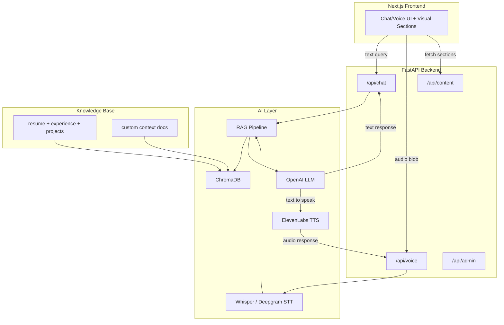

---

name: AI-native portfolio concept
overview: "JARVIS Agent OS" — a portfolio that IS an AI agent running inside a desktop OS interface, with a live Neo4j-style knowledge graph as wallpaper, token streaming everywhere, floating draggable windows, JARVIS-style cinematic boot, auto-speaking AI with mute button, emerald green accent on dark theme, fully mobile responsive.
todos:

- id: content-rag
content: "Content store + RAG knowledge base: JSON from resume, chunk and embed into ChromaDB"
status: pending
- id: fastapi-backend
content: "FastAPI backend: /api/chat (RAG+LLM), /api/voice (STT+TTS), /api/content, /api/admin"
status: pending
  - id: frontend-graph
  content: "Frontend knowledge graph wallpaper: animated force-directed graph, emerald green on dark"
  status: pending
  - id: frontend-boot
  content: "Frontend cinematic boot: token-streamed terminal text, graph pulses on each line"
  status: pending
  - id: frontend-os-shell
  content: "Frontend OS shell: dock/taskbar, floating draggable/resizable windows, window management"
  status: pending
  - id: frontend-jarvis
  content: "JARVIS window: chat UI with token streaming, mic button, auto-speak with mute, emerald waveform"
  status: pending
  - id: frontend-sections
  content: "Section windows: experience.log, projects.exe, skills.sys, achievements.dat, comms.link — all stream on open"
  status: pending
  - id: frontend-contact
  content: "comms.link: WhatsApp wa.me, mailto, LinkedIn, GitHub, resume download — all one-click"
  status: pending
  - id: frontend-mobile
  content: "Mobile responsive: full-screen panels, bottom dock, simplified graph, JARVIS floating button"
  status: pending
- id: admin-screen
content: Admin screen at /admin to edit content and re-index RAG
status: pending
- id: polish-deploy
content: Polish (animations, responsive, dark theme, SEO) and deploy (Vercel + Railway)
status: pending
isProject: false

---

# "JARVIS Agent OS" — an AI-native portfolio

## The core concept

The portfolio is an **AI Agent OS**. When someone lands on the site, they are dropped into Deshant's operating system — a dark, sleek, futuristic desktop interface. Behind every window, behind the wallpaper itself, is a living knowledge graph. The AI (JARVIS) auto-speaks, greets the visitor, and IS the portfolio. Everything streams token-by-token. Nothing just "appears."

**The medium is the message:** You build agentic AI systems. Your portfolio IS an agentic AI system, running as an OS, with a knowledge graph as its brain.

---

## Design decisions (confirmed)

- **Concept:** Agent OS with floating windows + JARVIS AI as centerpiece
- **Background wallpaper:** Live animated Neo4j-style knowledge graph (nodes = skills, experience, projects; edges = relationships). Emerald-green glowing nodes/edges on dark background. Slowly animates, pulses when the AI is "thinking."
- **Token streaming everywhere:** Boot sequence, chat responses, section content — all stream token-by-token like LLM output. No text appears instantly.
- **JARVIS voice:** Auto-speaks on page load with a visible mute button. Cinematic greeting.
- **OS interface:** Floating, draggable, resizable windows on desktop. Each "app" opens as a window over the graph wallpaper.
- **Mobile responsive:** On mobile, floating windows become full-screen stacked panels with a bottom dock/nav. The graph wallpaper scales down to a simpler particle animation. Chat/voice is always accessible via a floating JARVIS button.
- **Accent color:** Emerald green (#10b981 range) — nodes, glows, borders, highlights, JARVIS waveform. Easily swappable via CSS variable.

---

## Landing experience: the cinematic boot

1. **Black screen.** The knowledge graph fades in behind — nodes and edges slowly materializing in emerald green, like a neural network waking up.
2. **Token-streamed boot sequence** (text streams character-by-character, LLM-style, with a blinking cursor):

```
   > initializing agent_os...
   > loading knowledge graph... 47 nodes, 128 edges
   > indexing experience... [infogain, carpm, jio, c&s electric]
   > mounting capabilities... [langgraph, rag, multi-agent, fastapi]
   > connecting voice module... elevenlabs ready
   > system ready. launching jarvis.
   

```

   Each line streams in with slight delays. The graph wallpaper pulses/brightens with each line as if the system is "powering up."
3. **OS desktop materializes.** A taskbar/dock appears at the bottom. The JARVIS window opens center-screen — a chat interface with a glowing emerald waveform/orb.
4. **JARVIS auto-speaks** (ElevenLabs TTS, with mute button visible):
   *"Hey — I'm Deshant's AI. I know everything about his work, his projects, and his skills. Ask me anything, or just say 'give me the tour.' You can also type."*
   This greeting also streams as text in the chat window, token-by-token.
5. **Dock icons appear:** `Experience` | `Projects` | `Skills` | `Achievements` | `Contact` — clicking any opens the relevant floating window.

---

## The OS interface

**Desktop (large screens):**

- Full-screen dark background with the animated knowledge graph as wallpaper.
- **Floating windows** that are draggable and resizable. When you open "Experience," a window appears over the graph. You can move it, resize it, stack windows, minimize to dock.
- **JARVIS window** is always present (can be minimized but not closed). It has the chat interface + mic button + mute toggle.
- **Dock/taskbar** at the bottom with icons for each section + JARVIS.
- Windows have a title bar, close/minimize buttons, subtle emerald glow border.

**Mobile (phones/tablets):**

- The graph wallpaper simplifies to a subtler particle/node animation (performance).
- No floating windows — sections open as **full-screen panels** that slide in/out.
- **Bottom dock** with section icons + JARVIS button.
- Tapping JARVIS opens a full-screen chat/voice panel.
- All token streaming still works. Voice still works. Experience is preserved.

---

## How content is explored

**Primary: JARVIS (conversation).**

- All responses stream token-by-token.
- The AI can "open windows" — e.g. when you ask "What did Deshant build?", JARVIS streams a response AND opens the Projects window with cards.
- "I want to hire him" -> JARVIS opens the Contact window with one-click links.
- The knowledge graph wallpaper reacts: when discussing "Infogain," the Infogain node in the graph pulses/highlights.

**Secondary: Click-navigate via dock.**

- Click any dock icon to open that section's window.
- Each window contains rich content (timeline, cards, grids) that also streams in token-by-token when first opened.

**Voice mode:**

- Mic button in JARVIS window. Click to speak.
- JARVIS listens (STT), thinks (graph pulses), responds with voice (TTS) + streamed text + opens relevant windows.
- Auto-speak is on by default. Mute button toggles TTS on/off.

---

## Floating windows (OS apps)

Each section opens as a floating window over the graph wallpaper:

- `**jarvis.ai`** — The JARVIS chat/voice window. Always open by default. Chat input, streaming responses, mic button, mute toggle, emerald waveform animation.
- `**experience.log`** — Vertical timeline. Each role: company, title, dates, 3-5 metric-rich bullets, tech tags. All text streams in on first open.
- `**projects.exe`** — Featured project cards with title, description, metrics, stack pills, GitHub/demo links. Cards fade in one by one.
- `**skills.sys`** — Categorized grid (Gen AI and Agents, ML/DL, Backend, Cloud and DevOps, Databases, Tools). Cards with emerald glow on hover.
- `**achievements.dat`** — Certifications (NVIDIA CUDA, Transformer NLP), POR (GDG, Abhivyakti). Compact visual cards.
- `**comms.link**` — One-click contact:
  - WhatsApp: `https://wa.me/919354532389` (direct open)
  - Email: `mailto:deshantbani@gmail.com?subject=Reaching out from your portfolio`
  - LinkedIn: direct profile link
  - GitHub: direct link
  - Resume: one-click PDF download
  - Optional: Calendly "Book a call"

---

## The AI engine (FastAPI backend)




- `**/api/chat**` — Text in, text + visual-command out. The LLM response includes both conversational text AND structured commands (e.g. `{"show": "experience", "highlight": "infogain"}`), so the frontend knows what visual to display alongside the chat.
- `**/api/voice**` — Audio blob in, audio + text + visual-command out. Whisper transcribes, RAG pipeline processes, LLM responds, ElevenLabs speaks.
- `**/api/content**` — Static content API for visual sections (same as before, reads from JSON).
- `**/api/admin**` — Protected endpoints to update content without touching the repo (same admin screen as before, but now also updates the RAG knowledge base).
- **RAG knowledge base:** Your resume, experience bullets, project descriptions, skills, achievements — all chunked and embedded in ChromaDB. When someone asks "What did Deshant do at Jio?", retrieval pulls the relevant chunks and the LLM synthesizes a natural answer.

---

## Frictionless contact (the "reach out to me" philosophy)

Every contact method is **one click, zero forms**:

- **WhatsApp:** `<a href="https://wa.me/919354532389">` — opens WhatsApp Web or app. No form. No "enter your message." Direct.
- **Email:** `<a href="mailto:deshantbani@gmail.com?subject=Reaching out from your portfolio">` — opens their mail client with subject pre-filled.
- **LinkedIn:** Direct link to `linkedin.com/in/deshantbani`.
- **Resume:** Direct PDF download, one click.
- **Voice:** "I want to talk to Deshant" -> AI provides all contact options via voice + displays them.
- **Chat shortcut:** Typing "contact" or "hire" in the chat instantly shows the contact panel.

The AI itself can facilitate: "Would you like me to open WhatsApp so you can message Deshant directly?"

---

## The knowledge graph wallpaper

The background of the entire OS is a **live, animated knowledge graph** — not a static image but an interactive force-directed graph rendered with `react-force-graph` or a custom canvas/WebGL implementation.

- **Nodes** represent: your name (center, largest), each company (Infogain, CaRPM, Jio, C&S), each skill category, each project, each certification. ~47 nodes.
- **Edges** connect related items: Deshant -> Infogain, Infogain -> LangGraph, Infogain -> RAG, etc. ~128 edges.
- **Visual style:** Emerald green glowing nodes of varying sizes, thin emerald edges, dark (#0a0a0a) background. Subtle slow drift animation. Nodes pulse when relevant (e.g. when JARVIS is talking about Infogain, that node glows brighter).
- **Interactive:** On desktop, hovering a node shows a tooltip. Clicking a node could open the relevant window.
- **Mobile:** Simplified to fewer nodes or a particle animation for performance, still emerald-on-dark.
- **Data source:** Graph data is derived from the same `content.json` — a build script generates the node/edge structure.

---

## Tech stack

- **Frontend:** Next.js 15, TypeScript, Tailwind CSS, Framer Motion (window animations, streaming text), `react-force-graph` or `@react-three/fiber` (knowledge graph wallpaper), Web Audio API (voice recording)
- **Backend:** FastAPI (Python), serves chat API, voice API, content API, admin API
- **AI/RAG:** LangChain, ChromaDB (vector store), OpenAI API (LLM), system prompt tuned to be JARVIS — Deshant's agent
- **Voice:** Whisper or Deepgram (STT), ElevenLabs (TTS)
- **Content store:** JSON files on disk, also vectorized into ChromaDB for RAG
- **Admin:** Small admin UI at `/admin` to edit content without touching repo. Updates JSON + triggers RAG re-index.
- **Deploy:** Frontend on Vercel, Backend on Railway/Render/Fly.io

---

## Implementation order

1. **Content + RAG knowledge base:** JSON content from resume + chunk and embed into ChromaDB + generate graph node/edge data.
2. **FastAPI backend:** Chat API (RAG + LLM with streaming), voice API (STT + TTS), content API, admin API.
3. **Frontend — knowledge graph wallpaper:** Animated force-directed graph as full-screen background, emerald green on dark.
4. **Frontend — cinematic boot sequence:** Token-streamed terminal text over the graph igniting. Graph pulses with each boot line.
5. **Frontend — OS shell:** Dock/taskbar, floating draggable/resizable windows, minimize/close, window management.
6. **Frontend — JARVIS window:** Chat UI with token streaming, mic button, mute toggle, emerald waveform animation.
7. **Frontend — section windows:** experience.log, projects.exe, skills.sys, achievements.dat, comms.link. All content streams token-by-token on open.
8. **Frontend — frictionless contact:** WhatsApp wa.me link, mailto, LinkedIn, GitHub, resume download. All one-click in comms.link window.
9. **Admin screen:** `/admin` to edit content and re-index RAG.
10. **Mobile responsive:** Full-screen panels instead of floating windows, bottom dock, simplified graph, JARVIS floating button.
11. **Polish:** Animations, SEO, Open Graph, performance optimization, accessibility.
12. **Deploy:** Vercel (frontend) + Railway/Render (backend).

